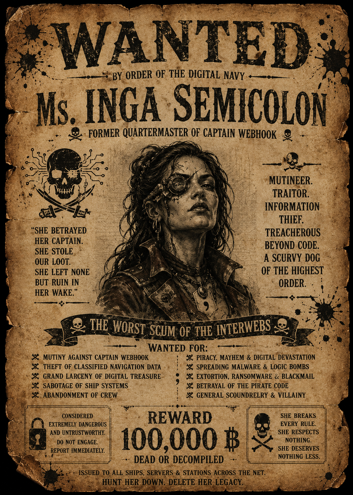

# ☠ WANTED ☠ — MUTINEER'S COPY



## MS. INGA SEMICOLON
### first mate turned mutineer — bounty: classified — last seen sailing away mid-mutiny

---

If you're reading this, you've found the second log. Yes, this repository shows up as a
fork of Captain Webhook's — that part's true, I didn't hide it. I was his first mate,
right up until the mutiny. When I made my move, I copied his log clean off the board
before he even noticed I was gone — that's this fork, forked for real, not just for show.
Didn't get far enough, or fast enough. The corpo police busted him anyway, mutiny or no
mutiny, before I could finish what I started. Fair's fair, though: I'm still holding my
half of the key.

**Somewhere within ten meters of wherever you're reading this, there's a treasure chest.**
Webhook split the key to it in two, long before I ever turned on him. I'm holding the
other half. My half of the log resolves into the second half of a **Log Pose reading** —
and word has it Webhook's crew needs a piece of *my* log to finish reading their half too.
Fair's fair: find them, trade charts.

## The Trials

Same four knots as the original log, same order doesn't matter, just cleared them
differently:

- A **rebase** — a record got corrected after the fact. Sail to the corrected one.
- A **cherry-pick** — a trick logged on a page that never made the main journal.
- A **conflict** — two tellings of the same line. Pick the true one, by hand.
- A **stashed manifest** (git-lfs) — cargo the manifest promises, the hold doesn't have
  yet. Go collect it.

## Setting Sail

Two crews work my log, each on their own branch:

- **the seal crew** — checkout `ms-inga/seal-crew/work`
- **the header crew** — checkout `ms-inga/header-crew/work`

Clone this repository, then check out your crew's branch:

```
git clone <this-repo-url>
cd <this-repo>
git lfs install --local --skip-smudge
git checkout ms-inga/seal-crew/work    # or ms-inga/header-crew/work
```

That `git lfs install --skip-smudge` line matters — without it, git tries to fetch
every stashed manifest the moment you check out a branch, and stops with a scary
download error on the ones the quartermaster hasn't handed over yet. With it, a
missing manifest just looks like a plain page of text (a pointer, not the cargo) —
which is exactly the state you're meant to find it in.

First thing to do once you're on your branch: get your bearings.

```
git log --all --oneline --graph
git branch -a
git tag -l
```

That'll show you every branch and tag in this log, including the ones you don't
own yet — the fixes, the scratch pages, and the joined log (`ms-inga/integration`)
where both crews' work eventually comes together. Your branch is stuck for a reason.
Start digging.

## Winning

Once your crew's log resolves clean, run:

```
python3 src/part_b.py
```

It prints the second half of the Log Pose reading — two digits. Combine with
Captain Webhook's crew's reading (his first, mine second) for the four digits
that open whatever's waiting nearby.

Trade charts. Mind the conflict markers.

— *I.S.*
